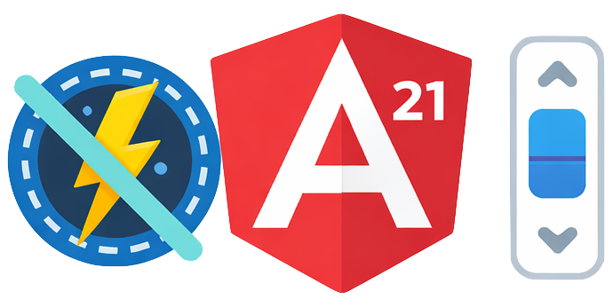

# ngx-zoneless-scrollbar

<p align="center">
  
</p>

<p align="center">
  <a href="https://stackblitz.com/github/Legalfina/ngx-zoneless-scrollbar/tree/main/demo?file=src%2Fapp.component.html">
    
  </a>
</p>

[](https://www.npmjs.com/package/ngx-zoneless-scrollbar)
[](https://www.npmjs.com/package/ngx-zoneless-scrollbar)
[](https://github.com/Legalfina/ngx-zoneless-scrollbar/blob/main/LICENSE)
[](https://github.com/Legalfina/ngx-zoneless-scrollbar/actions/workflows/publish.yml)
[](https://codecov.io/gh/Legalfina/ngx-zoneless-scrollbar)

A lightweight, zoneless-compatible scrollbar component for Angular. Uses native browser scrolling with CSS-styled scrollbars, designed specifically for Angular's zoneless change detection mode.

## Why ngx-zoneless-scrollbar?

Angular's zoneless mode (`provideZonelessChangeDetection()`) offers significant performance benefits, but many existing scrollbar libraries rely on Zone.js for change detection and `afterRenderEffect` callbacks that may not work correctly in zoneless mode.

**ngx-zoneless-scrollbar** solves this by:

- Using **native browser scrolling** - 100% reliable, no Zone.js dependency
- Using **ResizeObserver** directly - detects content changes without Angular's lifecycle
- Being **fully signal-based** - works seamlessly with Angular's reactive primitives
- Providing **CSS-styled scrollbars** - customizable appearance on all modern browsers

## Features

✅ **Zoneless Compatible** - Works perfectly with `provideZonelessChangeDetection()`  
✅ **Lightweight** - No heavy dependencies, uses native browser APIs  
✅ **Signal-based** - Exposes scrollability state as Angular signals  
✅ **Touch Friendly** - Supports momentum scrolling on mobile devices  
✅ **Customizable** - Easy to style with CSS variables  
✅ **Standalone** - Works with Angular's standalone components

## Installation

```bash
npm install ngx-zoneless-scrollbar
```

## Usage

### Basic Usage

```typescript
import { Component } from '@angular/core';
import { NgxZonelessScrollbar } from 'ngx-zoneless-scrollbar';

@Component({
  standalone: true,
  imports: [NgxZonelessScrollbar],
  template: `
    <ngx-zoneless-scrollbar>
      <div>Your scrollable content here</div>
    </ngx-zoneless-scrollbar>
  `,
  styles: [
    `
      ngx-zoneless-scrollbar {
        height: 400px; /* Required: Set a height for scrolling to work */
      }
    `,
  ],
})
export class MyComponent {}
```

### With Event Binding

```typescript
import { Component } from '@angular/core';
import { NgxZonelessScrollbar, ScrollbarUpdateEvent } from 'ngx-zoneless-scrollbar';

@Component({
  standalone: true,
  imports: [NgxZonelessScrollbar],
  template: `
    <ngx-zoneless-scrollbar #scrollbar (afterUpdate)="onScrollbarUpdate($event)">
      <div>Your content</div>
    </ngx-zoneless-scrollbar>

    <p *ngIf="scrollbar.isVerticallyScrollable()">Content is scrollable!</p>
  `,
})
export class MyComponent {
  onScrollbarUpdate(event: ScrollbarUpdateEvent) {
    console.log('Vertically scrollable:', event.isVerticallyScrollable);
    console.log('Horizontally scrollable:', event.isHorizontallyScrollable);
  }
}
```

### Programmatic Scrolling

```typescript
import { Component, ViewChild } from '@angular/core';
import { NgxZonelessScrollbar } from 'ngx-zoneless-scrollbar';

@Component({
  standalone: true,
  imports: [NgxZonelessScrollbar],
  template: `
    <ngx-zoneless-scrollbar #scrollbar>
      <div>Your content</div>
    </ngx-zoneless-scrollbar>

    <button (click)="scrollToTop()">Scroll to Top</button>
  `,
})
export class MyComponent {
  @ViewChild('scrollbar') scrollbar!: NgxZonelessScrollbar;

  scrollToTop() {
    this.scrollbar.scrollTo({ top: 0, behavior: 'smooth' });
  }
}
```

## API Reference

### Inputs

| Input         | Type                                           | Default      | Description      |
| ------------- | ---------------------------------------------- | ------------ | ---------------- |
| `orientation` | `'vertical' &#124; 'horizontal' &#124; 'auto'` | `'vertical'` | Scroll direction |

### Outputs

| Output        | Type                   | Description                            |
| ------------- | ---------------------- | -------------------------------------- |
| `afterUpdate` | `ScrollbarUpdateEvent` | Emits when scrollability state changes |

### Public Properties (Signals)

| Property                   | Type              | Description                                |
| -------------------------- | ----------------- | ------------------------------------------ |
| `isVerticallyScrollable`   | `Signal<boolean>` | Whether content is vertically scrollable   |
| `isHorizontallyScrollable` | `Signal<boolean>` | Whether content is horizontally scrollable |

### Public Methods

| Method                               | Description                            |
| ------------------------------------ | -------------------------------------- |
| `scrollTo(options: ScrollToOptions)` | Scroll to a specific position          |
| `update()`                           | Manually trigger a scrollability check |
| `viewportElement`                    | Get the native viewport element        |

## Styling

### CSS Variables

Customize the scrollbar appearance using CSS custom properties:

```css
ngx-zoneless-scrollbar {
  /* Scrollbar dimensions */
  --scrollbar-size: 8px;

  /* Track styling */
  --scrollbar-track-color: transparent;
  --scrollbar-track-radius: 4px;

  /* Thumb styling */
  --scrollbar-thumb-color: rgba(0, 0, 0, 0.3);
  --scrollbar-thumb-color-hover: rgba(0, 0, 0, 0.5);
  --scrollbar-thumb-radius: 4px;

  /* Advanced styling */
  --scrollbar-thumb-shadow: none;
  --scrollbar-thumb-shadow-hover: none;
  --scrollbar-thumb-border: none;
  --scrollbar-thumb-border-hover: none;
}
```

### Available CSS Custom Properties

| Property                         | Default              | Description                                                  |
| -------------------------------- | -------------------- | ------------------------------------------------------------ |
| `--scrollbar-size`               | `7px`                | Width of vertical scrollbar / height of horizontal scrollbar |
| `--scrollbar-track-color`        | `transparent`        | Background color of the scrollbar track                      |
| `--scrollbar-track-radius`       | `4px`                | Border radius of the scrollbar track                         |
| `--scrollbar-thumb-color`        | `rgba(0, 0, 0, 0.3)` | Color of the scrollbar thumb (supports gradients)            |
| `--scrollbar-thumb-color-hover`  | `rgba(0, 0, 0, 0.5)` | Color of the scrollbar thumb on hover (supports gradients)   |
| `--scrollbar-thumb-radius`       | `4px`                | Border radius of the scrollbar thumb                         |
| `--scrollbar-thumb-shadow`       | `none`               | Box shadow of the scrollbar thumb (e.g., for glow effects)   |
| `--scrollbar-thumb-shadow-hover` | `none`               | Box shadow of the scrollbar thumb on hover                   |
| `--scrollbar-thumb-border`       | `none`               | Border of the scrollbar thumb                                |
| `--scrollbar-thumb-border-hover` | `none`               | Border of the scrollbar thumb on hover                       |

### Custom Styles Examples

```css
/* Dark theme scrollbar */
.dark-theme ngx-zoneless-scrollbar {
  --scrollbar-thumb-color: rgba(255, 255, 255, 0.3);
  --scrollbar-thumb-color-hover: rgba(255, 255, 255, 0.5);
}

/* Thin scrollbar */
.thin-scrollbar ngx-zoneless-scrollbar {
  --scrollbar-size: 4px;
  --scrollbar-thumb-radius: 2px;
}

/* Neon glow effect */
.neon-scrollbar ngx-zoneless-scrollbar {
  --scrollbar-size: 14px;
  --scrollbar-thumb-color: #00ff88;
  --scrollbar-thumb-color-hover: #00ffcc;
  --scrollbar-thumb-radius: 7px;
  --scrollbar-thumb-shadow: 0 0 10px #00ff88, 0 0 20px #00ff88;
  --scrollbar-thumb-shadow-hover: 0 0 15px #00ffcc, 0 0 30px #00ffcc, 0 0 45px #00ffcc;
}

/* Gradient scrollbar */
.gradient-scrollbar ngx-zoneless-scrollbar {
  --scrollbar-size: 16px;
  --scrollbar-thumb-color: linear-gradient(135deg, #f093fb 0%, #f5576c 100%);
  --scrollbar-thumb-color-hover: linear-gradient(135deg, #fa89f7 0%, #ff4757 100%);
  --scrollbar-thumb-radius: 999px;
}

/* Square corners with border */
.squared-scrollbar ngx-zoneless-scrollbar {
  --scrollbar-size: 12px;
  --scrollbar-thumb-color: #ff6b35;
  --scrollbar-thumb-color-hover: #ff4500;
  --scrollbar-thumb-radius: 0px;
  --scrollbar-thumb-border: 2px solid #fff;
  --scrollbar-thumb-border-hover: 2px solid #000;
}
```

## Browser Support

- ✅ Chrome 88+
- ✅ Firefox 64+
- ✅ Safari 14+
- ✅ Edge 88+

All browsers that support CSS `scrollbar-width` and `::-webkit-scrollbar` pseudo-elements.

## Migration from ngx-scrollbar

If you're migrating from `ngx-scrollbar` due to zoneless compatibility issues:

```html
<!-- Before (ngx-scrollbar) -->
<ng-scrollbar #scrollbar="ngScrollbar" (afterUpdate)="onUpdate(scrollbar.adapter.isVerticallyScrollable())">
  <content />
</ng-scrollbar>

<!-- After (ngx-zoneless-scrollbar) -->
<ngx-zoneless-scrollbar #scrollbar (afterUpdate)="onUpdate($event.isVerticallyScrollable)">
  <content />
</ngx-zoneless-scrollbar>
```

## Contributing

Contributions are welcome! Please feel free to submit a Pull Request.

## Contributors

- [Farshad Hemmati](https://github.com/farshadhemmati)

## License

MIT © [Legalfina](https://www.legalfina.com/en)
